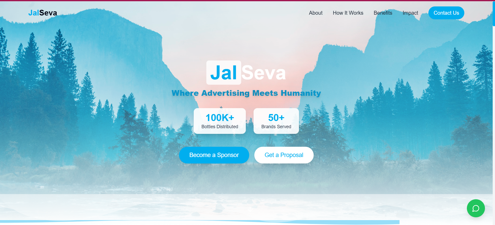
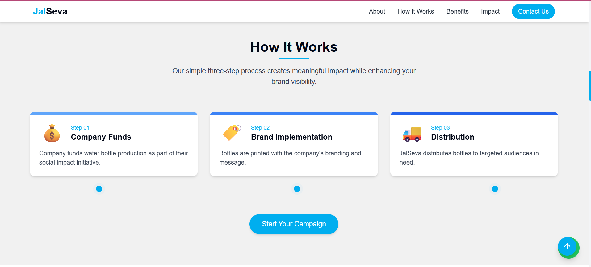
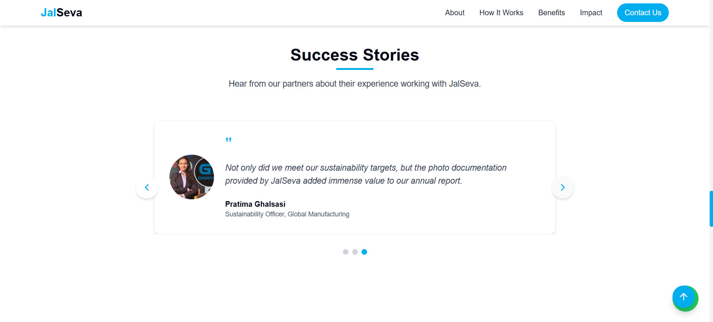

<h1 align="center">🌊 paniseva — Empowering CSR for a Better Tomorrow</h1>

<p align="center">
  
  
  
</p>

<p align="center">
  <strong>Live App ➔</strong> <a href="https://paniseva.netlify.app/">paniseva.netlify.app</a> •
  <strong>GitHub ➔</strong> <a href="https://github.com/onkarpacharne/paniseva_Project">onkarpacharne/paniseva_Project</a>
</p>

---

## 🌟 Project Overview

**paniseva** is a CSR (Corporate Social Responsibility)-driven initiative that bridges the gap between companies seeking meaningful social impact and water-centric community needs. Companies often spend CSR funds but struggle to measure or showcase impact — **paniseva solves this problem** by offering an end-to-end platform for project discovery, funding, tracking, and impact visualization.

---

## 🔥 Highlights

* Transparent CSR project management
* Real-time impact dashboard
* Verified success stories from communities
* Easy onboarding for donors and NGOs
* Fully responsive & accessible UI

---

## 🚀 Tech Stack

| Tech         | Description                            |
| ------------ | -------------------------------------- |
| Vite         | Superfast bundler & development server |
| TypeScript   | Type-safe development                  |
| React        | Component-based UI                     |
| Tailwind CSS | Utility-first styling                  |
| shadcn-ui    | Prebuilt elegant UI components         |
| React Router | For client-side routing                |
| Netlify      | Deployment platform                    |

---

## 📁 Folder Structure

```
paniseva_Project/
├── public/                 # Static files like images, icons, and robots.txt  
│   ├── images/  
│   ├── onkarp-uploads/  
│   └── favicon.ico  
├── screenshots/            # Screenshots for README documentation  
│   ├── landing.png  
│   ├── about.png  
│   ├── howItWorks.png  
│   ├── successStories.png  
│   ├── impactDashboard.png  
│   └── footer.png  
├── src/                    # Application source code  
│   ├── assets/             # Static assets like logos, SVGs, etc.  
│   ├── components/         # Reusable UI components (Buttons, Layouts, etc.)  
│   ├── hooks/              # Custom React hooks  
│   ├── integrations/       # API or third-party service integrations  
│   ├── lib/                # Utility libraries or constants  
│   ├── pages/              # Page-level React components  
│   ├── App.tsx             # Main App component  
│   ├── App.css             # Global styles  
│   └── main.tsx            # Entry point  
├── supabase/               # Supabase configurations and edge functions  
│   ├── config.toml  
│   ├── functions/  
│   └── migrations/  
├── index.html              # HTML template  
├── tailwind.config.ts      # Tailwind CSS configuration  
├── vite.config.ts          # Vite configuration file  
├── tsconfig*.json          # TypeScript configuration files  
├── postcss.config.js       # PostCSS config for Tailwind  
├── package.json            # Project metadata and dependencies  
├── bun.lockb               # Bun package lock file  
├── eslint.config.js        # ESLint configuration  
└── README.md               # Project documentation  
```

> 💡 This structure ensures a clean separation of concerns for scalability and maintainability.

---

## 🖼️ UI Screenshots

> Here's a quick look at the platform 👇

### 🏠 Landing Page



---

### 📖 About Us


---

### ⚙️ How It Works



---

### 🌟 Success Stories



---

### 📊 Impact Dashboard


---

### 🔗 Footer with Privacy and Terms


---

## 🧠 Problem Statement

> **Corporates use CSR funds, but they rarely get transparent insights or real social engagement benefits.**

Most organizations fund NGOs without an interactive medium to see their impact or engage users. This causes low visibility, inefficiency, and less accountability.

---

## ✅ Solution by paniseva

* 📌 Platform for listing verified water-based CSR projects.
* 🧾 Real-time tracking, updates, and dashboards.
* 🏆 Reward systems, recognition badges for corporates.
* 🌍 Success stories to inspire and promote further impact.

---

## 🎯 Future Scope

* Integration with Government APIs
* Blockchain-based impact verification
* CSR Impact Leaderboard across India
* Real-time Chatbot support

---

## ⚙️ Project Setup

This project uses **Vite**, **TypeScript**, **React**, **Tailwind CSS**, and **shadcn/ui** for fast performance and modern UI development. Follow the steps below to set it up locally.

---

### 📦 Prerequisites

Make sure you have the following installed:

* **Node.js** (v18+ recommended)
* **Bun** (optional, if using Bun for package management)
  👉 Install from: [https://bun.sh/docs/installation](https://bun.sh/docs/installation)
* **Git**

---

### 🚀 Installation

1. **Clone the repository**

```bash
git clone https://github.com/onkarpacharne/paniseva_Project.git
cd paniseva_Project
```

2. **Install dependencies**

Using Bun (preferred):

```bash
bun install
```

Or using npm:

```bash
npm install
```

3. **Start the development server**

Using Bun:

```bash
bun run dev
```

Or using npm:

```bash
npm run dev
```

4. **Open in browser**

Visit: [http://localhost:5173](http://localhost:5173)

---

### 🛠️ Build for Production

To generate a production-ready build:

```bash
bun run build
# or
npm run build
```

This will output files to the `dist/` folder.

---

### 🧪 Preview Build

To preview the production build locally:

```bash
bun run preview
# or
npm run preview
```

---

### 🪤 Linting

To check for code quality and formatting:

```bash
bun run lint
# or
npm run lint
```

---

### 📁 Environment Variables

If required, add a `.env` file in the root directory with the following format:

```
VITE_API_URL=https://your-backend-api.com
SUPABASE_URL=...
SUPABASE_ANON_KEY=...
```

Ensure your keys are stored securely and never committed to GitHub.

---

## 🤝 Contributing

Contributions are welcome! Feel free to fork and submit PRs.

```bash
# Fork the project
# Make changes
# Push your feature branch
# Create Pull Request
```

---

## 📃 License

This project is licensed under the [MIT License](LICENSE).


---

## 📬 Connect With Us

**Founder: Onkar Pacharane**

**Email: [onkarpacharane950@gmail.com](mailto:onkarpacharane950@gmail.com)**

**LinkedIn:<strong><a href="https://www.linkedin.com/in/onkar-pacharane-b0195b37a/">Rushikesh Dalavi</a></strong>**

> ⚡ Note: Parts of this project were created with the help of AI-based coding tools (e.g., GitHub Copilot, ChatGPT,onkarp). All final code was reviewed and modified by the author.

